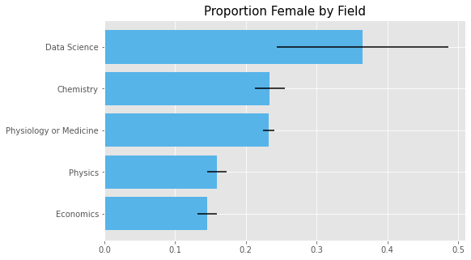

# Introduction

The goal of this project is to measure the gender gap between men and women in various fields using scraped data from wikipedia. 

It is important to acknowledge that there are more than two genders. Due to data constraints, for this project, I examine the difference between only men and women in a field. 

# Data
 
## Creating the Dataset [1](#foot1)

To acquire this data, I scraped wikipedia pages to create a novel dataset. Using the `Requests` library and `BeautifulSoup`, I grabbed the profiles of individuals listed under relevant categories and saved the information into a `Mongo` database. I chose to focus on categories relevant to the Nobel Prize fields (i.e. physics, chemistry, physiology or medicine, literature, peace, and economics), then narrowed it down to economics and STEM fields. I excluded literature categories because the categories were too vast for the time constraints of this project. I similarly excluded the peace category because winners of the peace category generally come from a broad range of fields making it difficult to categorize. Data scientists is the one non-Nobel category included out of personal interest.  

The origin categories I chose were:
- [Data Scientists](https://en.wikipedia.org/wiki/Category:Data_scientists)
- [20th Century Economists](https://en.wikipedia.org/wiki/Category:20th-century_economists)
- [21st Century Economists](https://en.wikipedia.org/wiki/Category:21st-century_economists)
- [20th Century Chemists](https://en.wikipedia.org/wiki/Category:20th-century_chemists)
- [21st Century Chemists](https://en.wikipedia.org/wiki/Category:21st-century_chemists)
- [20th Century Physicists](https://en.wikipedia.org/wiki/Category:20th-century_physicists)
- [21st Century Physicists](https://en.wikipedia.org/wiki/Category:21st-century_physicists)
- [20th Century Biologists](https://en.wikipedia.org/wiki/Category:20th-century_biologists)
- [21st Century Biologists](https://en.wikipedia.org/wiki/Category:21st-century_biologists)
- [Microbiologists ](https://en.wikipedia.org/wiki/Category:Microbiologists)
- [20th Century Physicians](https://en.wikipedia.org/wiki/Category:20th-century_physicians)
- [21st Century Physicians](https://en.wikipedia.org/wiki/Category:21st-century_physicians)

Most categories on wikipedia have subcategories, and individuals listed underneath a category might not be tagged in a subcategory and visa versa. For example, [Paul Krugman](https://en.wikipedia.org/wiki/Paul_Krugman) is not listed under 21st Century Economists, but is listed under the subcategory, 21st Century American Economists. Given the imperfect nature of the wikipedia tags and categories, I also included all individuals listed under 2 levels of subcategories. 

Once I scraped the names and links of individuals under each category and subcategory, I scraped the body text of their profiles and used the information in the text to determine their gender, length of their profile, and whether they held a doctorate. 

## Data Description 
After cleaning the created dataset by removing irrelevant categories (e.g. Cultural Depictions of Marie Curie) and profiles that were not people (e.g. Alteryx), I was left with **17,782** individuals

### Key Variables

- **Gender**: To determine the gender of an individual, I counted the number of times gendered words appeared on their page. For female, I used "she", "her", and "hers". For male, I used "he", "him", and "his". Which count was greater determined the gender of the individual in the dataset. [2](#foot2)
- **Ph.D.**: An individual is considered to have a Ph.D. if the word "Ph.D." appeared at least once in their profile. [3](#foot3)
- **Field**: The various origin categories were further organized into broader fields. 
    - Data Science - Data Scientists
    - Chemistry - 20th Century Chemists, and 21st Century Chemists
    - Economics - 20th Century Economists, and 21st Century Economists
    - Physics - 20th Century Physicists, and 21st Century Physicists
    - Physiology - 20th Century Biologists, 21st Century Biologists, Microbiologists, 20th Century Physicians, and 21st Century Physicians

### Table 1. Summary Statistics
|    | Field                  |     N |   Female (proportion) |   Ph.D (proportion) |
|----|------------------------|-------|-----------------------|---------------------|
|   | Data Science           |    63 |                 0.365 |               0.302 |
|   | Chemistry              |  1659 |                 0.234 |               0.429 |
|   | Economics              |  2576 |                 0.145 |               0.395 |
|   | Physics                |  2837 |                 0.159 |               0.417 |
|   | Physiology or Medicine | 10647 |                 0.232 |               0.139 |

# Visualizations and Analysis

This figure represents the proportion of women in each field. The bars are the 95% confidence interval. Across all of the fields included in this project, there is a smaller proportion of women in the field than men. Data science appears to have the largest proportion that are women but due to the smaller sample size (N = 63), it also has a large standard error. Out of the fields included, Economics and Physics have the smallest proportion of women. 

These results are not surprising given that data science is a relatively new field. To further explore this hypothesis, I compared the proportion of profile that were female in the wikipedia categories that could be split between the 20th century and 21st century. 

Unsurprisingly, for fields split between 20th century and 21st century categories, there is a significantly greater gender gap in the 20th century group. I use a bayes test to calculate the percent likelihood that the proportion of women in a field is greater in the 21st century than the 20th century. Visualizations of the bayes tests are below. 

For every field except for physicists, the percent likelihood that the proportion of women is higher in the 21st century than the 20th century is 100%. For physicists, the percent likelihood that the proportion of women is greater in the 21st century than in the 20th century is 99.85%. 

_________________________________________________________
<a name="foot1">[1]</a> I scraped Wikipedia on October 29, 2020. As a website that is constantly changing, the data scraped from their site will also change. The data used for analysis here is available in [csv form in the data folder](https://github.com/isbhsun/Gender-Gap-Analysis/blob/master/data/wiki_profile.csv) of this repository, and the code used to scrape this data is available in the [src folder](https://github.com/isbhsun/Gender-Gap-Analysis/tree/master/src) of this repository.

<a name="foot2">[2]</a>  I also counted the instances of occurrences of nonbinary pronouns: "they", "them", "theirs", "ze", "zir", "hir". However, I was unable to determine that any of the profiles were of nonbinary gendered individuals. Closer inspection of profiles where instances of nonbinary words were greater than male of female words revealed that in the case of this data, it was common that "they" and "them" were used frequently for profiles of individuals who worked collaboratively with others. 

<a name="foot3">[3]</a>  It is very likely that this method of determining whether an individual has a PhD or not is not always accurate. 

____________________________________________________
Feedback and constructive criticism is always welcome! If you have any comments, questions, suggestions, ideas, or simply any interest in discussing the topics in this project, feel free to email isbhsun@gmail.com.
