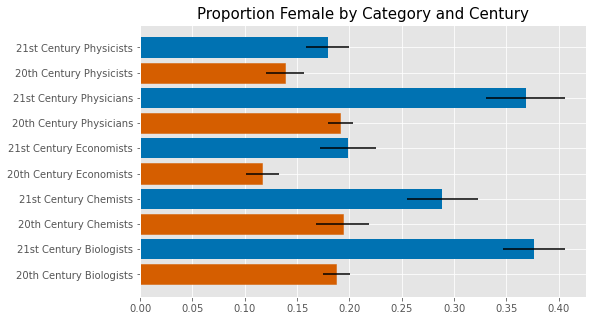

# Introduction

The goal of this project is to measure the gender gap in various fields using scraped data from wikipedia. 

Rather than measuring the proportion of women in a field, this analysis looks specifically at individuals at the top of their field, the assumption being that individuals with a wikipedia page are somewhat notable figures. 

It is important to acknowledge that there are more than two genders. Due to data constraints, for this project, I examine the difference between only men and women in a field. 

# Data
 
## Creating the Dataset

To acquire this data, I scraped wikipedia pages to create a novel dataset. Using the Requests library and BeautifulSoup, I grabbed the profiles of individuals listed under relevant categories and saved the information into a Mongo database. I chose to focus on categories relevant to the Nobel Prize fields (i.e. physics, chemistry, physiology or medicine, literature, peace, and economics), then narrowed it down to economics and STEM fields. I excluded literature categories because the categories were too vast for the time constraints of this project. I similarly excluded the peace category because winners of the peace category generally come from a broad range of fields making it difficult to categorize. Data scientists is the one non-Nobel category included out of personal interest.  

The origin categories I chose were:
- [Data Scientists](https://en.wikipedia.org/wiki/Category:Data_scientists)
- [20th Century Economists](https://en.wikipedia.org/wiki/Category:20th-century_economists)
- [21st Century Economists](https://en.wikipedia.org/wiki/Category:21st-century_economists)
- [20th Century Chemists](https://en.wikipedia.org/wiki/Category:20th-century_chemists)
- [21st Century Chemists](https://en.wikipedia.org/wiki/Category:21st-century_chemists)
- [20th Century Physicists](https://en.wikipedia.org/wiki/Category:20th-century_physicists)
- [21st Century Physicists](https://en.wikipedia.org/wiki/Category:21st-century_physicists)
- [20th Century Biologists](https://en.wikipedia.org/wiki/Category:20th-century_biologists)
- [21st Century Biologists](https://en.wikipedia.org/wiki/Category:21st-century_biologists)
- [Microbiologists ](https://en.wikipedia.org/wiki/Category:Microbiologists)
- [20th Century Physicians](https://en.wikipedia.org/wiki/Category:20th-century_physicians)
- [21st Century Physicians](https://en.wikipedia.org/wiki/Category:21st-century_physicians)

Most categories on wikipedia have subcategories, and individuals listed underneath a category might not be tagged in a subcategory and visa versa. For example, [Paul Krugman](https://en.wikipedia.org/wiki/Paul_Krugman) is not listed under 21st Century Economists, but is listed under the subcategory, 21st Century American Economists. Given the imperfect nature of the wikipedia tags and categories, I also included all individuals listed under 2 levels of subcategories. 

Once I scraped the names and links of individuals under each category and subcategory, I scraped the body text of their profiles and used the information in the text to determine their gender, length of their profile, and whether they held a doctorate. 

## Data Description 
After cleaning the created dataset, I was left with 17,782 individuals

### Key Variables

- **Gender**: To determine the gender of an individual, I counted the number of times gendered words appeared on their page. For female, I used "she", "her", and "hers". For male, I used "he", "him", and "his". The gender of the individual was constructed by which count was greater. [1](#foot1)
- **Ph.D.**: An individual is considered to have a Ph.D. if the word "Ph.D." appeared at least once in their profile. 
- **Field**: The various origin categories were further organized into broader fields. 
    - Data Science - Data Scientists
    - Chemistry - 20th Century Chemists, and 21st Century Chemists
    - Economics - 20th Century Economists, and 21st Century Economists
    - Physics - 20th Century Physicists, and 21st Century Physicists
    - Physiology - 20th Century Biologists, 21st Century Biologists, Microbiologists, 20th Century Physicians, and 21st Century Physicians

+----+------------------------+-------+-----------------------+---------------------+---------------------+
|    | Field                  |     N |   Female (proportion) |   Male (proportion) |   Ph.D (proportion) |
+====+========================+=======+=======================+=====================+=====================+
|  1 | Data Science           |    63 |                 0.365 |               0.635 |               0.302 |
+----+------------------------+-------+-----------------------+---------------------+---------------------+
|  0 | Chemistry              |  1659 |                 0.234 |               0.766 |               0.429 |
+----+------------------------+-------+-----------------------+---------------------+---------------------+
|  2 | Economics              |  2576 |                 0.145 |               0.855 |               0.395 |
+----+------------------------+-------+-----------------------+---------------------+---------------------+
|  3 | Physics                |  2837 |                 0.159 |               0.841 |               0.417 |
+----+------------------------+-------+-----------------------+---------------------+---------------------+
|  4 | Physiology or Medicine | 10647 |                 0.232 |               0.768 |               0.139 |
+----+------------------------+-------+-----------------------+---------------------+---------------------+

# Visualizations

# Analysis 

# Conclusion 

<a name="foot1">[1]</a>  I also counted the instances of occurrences of nonbinary pronouns: "they", "them", "theirs", "ze", "zir", "hir". However, I was unable to determine that any of the profiles were of nonbinary gendered individuals. Closer inspection of profiles where instances of nonbinary words were greater than male of female words revealed that in the case of this data, it was common that "they" and "them" were used frequently for profiles of individuals who worked collaboratively with others. 